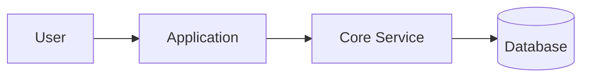

# 技术 README 推荐骨架

## 标准骨架

````markdown
# 项目名

> 一句话描述：说明项目解决什么问题、服务谁、核心价值是什么。

## 快速开始

### 环境要求

- 运行时版本
- 依赖服务

### 安装

```bash
# 安装命令
```

### 启动

```bash
# 启动命令
```

### 验证

```bash
# 最小验证命令或访问方式
```

## 核心特性

- 特性 1：解决的问题 / 带来的收益
- 特性 2：解决的问题 / 带来的收益
- 特性 3：解决的问题 / 带来的收益

## 技术栈

| 类别 | 选型 | 用途 |
| --- | --- | --- |
| 前端 / 客户端 |  |  |
| 后端 / 服务 |  |  |
| 数据存储 |  |  |
| 基础设施 |  |  |

## 架构图



补 2-5 句解释组件职责、依赖关系与主路径。

## 目录结构说明

```text
.
├── src/
├── config/
├── scripts/
└── README.md
```

- `src/`：核心业务代码
- `config/`：配置文件与环境区分
- `scripts/`：开发、构建或运维脚本

## 工作流程

1. 输入如何进入系统
2. 核心处理链路如何流转
3. 输出如何产生或交付

## 配置说明

| 配置项 | 必填 | 默认值 | 说明 |
| --- | --- | --- | --- |
| `APP_ENV` | 是/否 | `dev` | 运行环境 |
| `API_BASE_URL` | 是/否 |  | 外部服务地址 |
````

## 填写提示

- 一句话描述优先写“问题 + 用户 + 价值”，避免空泛口号。
- 快速开始只保留首轮上手必需步骤，部署细节可外链到其他文档。
- 架构图下必须补文字说明，避免只给图不给语义。
- 目录结构说明只写核心目录，避免把整个仓库原样贴满。
- 配置说明要明确敏感项来源，不要把密钥直接写进示例值。
